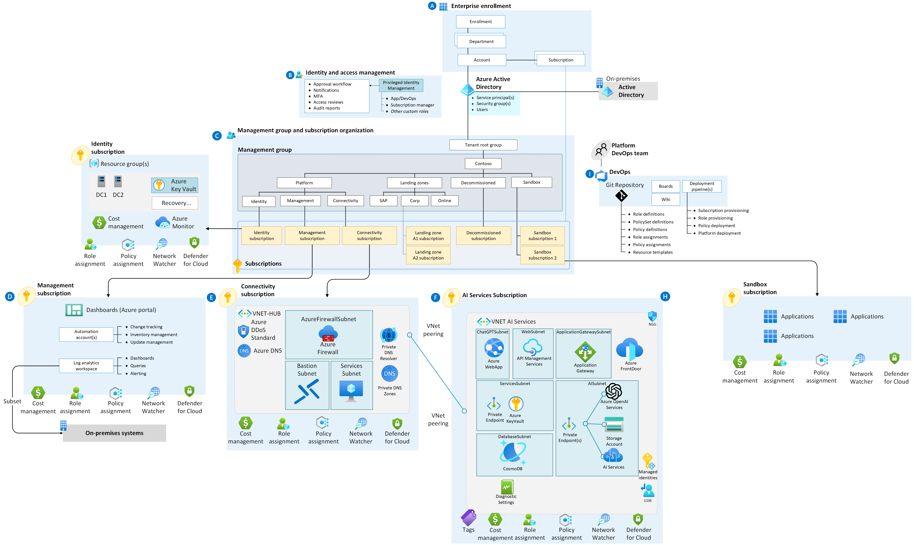

# Azure AI Landing Zone

This is an Azure supported AI Landing Zone module
- https://techcommunity.microsoft.com/t5/azure-architecture-blog/empowering-ai-building-and-deploying-azure-ai-landing-zones-with/ba-p/3891249
- https://github.com/FreddyAyala/AzureAIServicesLandingZone

## Author: Freddy Ayala @FreddyAyala https://techcommunity.microsoft.com/t5/user/viewprofilepage/user-id/1940863#profile



This GitHub repository provides a comprehensive guide and Terraform configurations to deploy an Azure AI Landing Zone—a specialized environment for empowering AI technologies, including advanced language models like GPT-4. The landing zone is designed to complement existing data management and data landing zones within your cloud-scale data analytics platform, enabling you to unlock the true potential of AI.

## Getting Started

To deploy the Azure AI Landing Zone with Terraform, follow the steps below:

### 1. Set up Connectivity

- Create a file `/Landing_Zones/terraform.tfvars`.
- Replace `<your connectivity subscription>` with your actual connectivity subscription ID in the `connectivity_subscription` field.
- Modify settings in the file `/Landing_Zone/settings.connectivity.tf` based on your requirements.
- Authenticate to Azure using `az login`.

### 2. Initialize and Preview the Deployment

- Open your command line interface application and navigate to the `/Landing_Zone` folder.
- Run `terraform init -reconfigure` to initialize the Terraform repository using local state.
- Preview the deployment by running `terraform plan -var-file="terraform.tfvars"`.

### 3. Deploy the Connectivity Infrastructure

- Execute `terraform apply -var-file="terraform.tfvars"` to deploy the connectivity infrastructure for the landing zone.

### 4. Deploy AI Workloads

- Navigate to the `/Workload/AI` folder.
- Create a file `/Workload/AI/terraform.tfvars`.
- Replace `<your connectivity subscription>` and `<your AI subscription>` with your respective subscription IDs.
- Copy the ID of your hub VNet deployed during the landing zone and paste it in the `hub_vnet_id` field.
- Follow the same steps as above to deploy the AI workloads.

### 5. Configure APIM

- Use the provided policy in the README to test OpenAI API behind APIM.
- Replace `<Your OpenAI API Key>` and `<Your OpenAI Backend Service>` with your actual API key and backend service URL.
```
<!--
    IMPORTANT:
    - Policy elements can appear only within the <inbound>, <outbound>, <backend> section elements.
    - To apply a policy to the incoming request (before it is forwarded to the backend service), place a corresponding policy element within the <inbound> section element.
    - To apply a policy to the outgoing response (before it is sent back to the caller), place a corresponding policy element within the <outbound> section element.
    - To add a policy, place the cursor at the desired insertion point and select a policy from the sidebar.
    - To remove a policy, delete the corresponding policy statement from the policy document.
    - Position the <base> element within a section element to inherit all policies from the corresponding section element in the enclosing scope.
    - Remove the <base> element to prevent inheriting policies from the corresponding section element in the enclosing scope.
    - Policies are applied in the order of their appearance, from the top down.
    - Comments within policy elements are not supported and may disappear. Place your comments between policy elements or at a higher level scope.
-->
<policies>
    <inbound>
        <base />
        <set-header name="api-key" exists-action="override">
            <value> <!-- Add Your OpenAI API Key --></></value>
        </set-header>
        <set-header name="Content-Type" exists-action="override">
            <value>application/json</value>
        </set-header>
        <set-backend-service base-url="https://<!-- Your OpenAI Backend Service -->.privatelink.openai.azure.com" />
    </inbound>
    <backend>
        <forward-request timeout="5" />
    </backend>
    <outbound>
        <!-- Add a policy to capture and return the full response -->
        <base />
        <return-response>
            <set-status code="200" />
            <set-header name="Content-Type" exists-action="override">
                <value>application/json</value>
            </set-header>
            <set-body>@(context.Response.Body.As<string>())</set-body>
        </return-response>
    </outbound>
    <on-error />
</policies>
```
## What's Included

This repository contains Terraform configurations and settings to deploy the following components:

### Connectivity Components:
- Azure Virtual Networks (Hub) for secure connectivity to on-premises systems and other spoke networks.
- Azure Firewall, a network-based, stateful firewall to control and inspect traffic flow in and out of the hub.
- Bastion, a secure remote desktop access solution for VMs in the virtual network.
- Jumpbox, a secure jump host to access VMs in private subnets.

### AI Workloads:
- Azure Open AI, a managed AI service for running advanced language models like GPT-4.
- Separate Virtual Networks (Spokes) for securely hosting AI workloads.
- Subnets within spokes to isolate different components.
- Route Tables for controlling traffic flow within virtual networks.
- Application Gateway, a load balancer for secure access to web applications and AI services.
- Azure API Management as the API gateway for managing and securing APIs, including Azure Open AI.
- Private DNS Zones for name resolution within the virtual network and between VNets.
- Cosmos DB, a globally distributed, multi-model database service to support AI applications.
- Web applications in Azure Web App.
- Azure AI services for building intelligent applications.

## Configuration Tips

This GitHub repository provides a foundation for your AI Landing Zone. However, it's essential to consider additional enhancements and best practices for your specific use case. Here are some tips for further improvement:

- Implement Managed Identity for authenticating with Azure services.
- Integrate Azure Key Vault for centralized secrets management.
- Explore advanced networking configurations like Azure Virtual WAN and ExpressRoute to optimize network performance and connectivity.
- Enable SSL/TLS certificates at the Azure Application Gateway level to enhance data encryption and security.

## Contributions

Contributions to this repository are welcome! Feel free to raise issues or submit pull requests for any improvements, bug fixes, or additional features that can benefit the community.

## License

This project is licensed under the [MIT License](link_to_license). You are free to use, modify, and distribute the code as per the terms of the license.

Let's empower AI enthusiasts like you to revolutionize AI technology with Azure and Terraform. Share this repository with your network and join our community of innovators! 🌟 #AI #Azure #Terraform #CloudComputing #TechInnovation
## Empowering AI: Building and Deploying Azure AI Landing Zones with Terraform

To harness the true potential of AI technologies, like GPT-4, a robust and efficient infrastructure is crucial. Azure Landing Zones provide a structured approach to create a rock-solid cloud environment, while Azure OpenAI Service seamlessly handles AI model deployment and management.
Enter Terraform—an Infrastructure as Code (IaC) tool that streamlines the process, ensuring repeatability, consistency, and security. With Terraform, developers and IT teams define the entire AI infrastructure in code, making it simpler to build, modify, and version resources.

In this article, we delve into leveraging Terraform to deploy the Azure OpenAI Landing Zone architecture concentrating on the connectivity and application aspects. By integrating various Azure services and implementing features like Azure Firewall, Virtual Networks, and Private Endpoints, Private DNS Zones, organizations can create a secure and scalable AI environment.

We'll also explore the best practices of the Azure Cloud Adoption Framework, a comprehensive guide by Microsoft to ensure successful cloud adoption and alignment with business goals. By following these practices, organizations can accelerate their AI initiatives and maximize the value of Azure services.

Join us as we embark on a journey into the world of Azure AI Landing Zones using Terraform, unlocking the true power of AI for your organization.

### Connectivity
The connectivity subscription in Azure Cloud Adoption Framework and Azure Landing Zones is a dedicated Azure subscription used to manage network connectivity resources. It isolates networking components, providing centralized control over configurations, secure connections with on-premises networks, and consistent policies.

Using a connectivity subscription benefits AI Services in several ways:
Network Isolation: Keeps AI resources separate from other workloads, reducing unauthorized access risks.
Centralized Management: Simplifies and ensures consistency in managing network configurations and security policies.
Secure Connections: Enables safe communication with on-premises systems using ExpressRoute or VPN Gateways.
Scalability and Performance: Optimizes network performance for efficient AI workloads.
Compliance and Governance: Helps meet organizational and regulatory requirements for networking and data handling.
Easy Resource Tracking: Simplifies tracking and managing network-related costs.
In the article, we will leverage the Azure Landing Zones Terraform module (https://github.com/Azure/terraform-azurerm-caf-enterprise-scale) to quickly deploy crucial connectivity resources like the Hub, Vnets, and Azure Firewall. This module streamlines the creation of platform resources based on Azure landing zones architecture, efficiently building the foundation for your Azure workloads.

### Target Architecture


In our target architecture, we'll be adopting the hub and spoke topology—a popular networking design in Azure. The hub acts as a central point of connectivity, and each spoke represents a dedicated landing zone or network segment.

A spoke, also known as a landing zone, is a focused area that houses specific resources or services. It ensures isolation for improved security and better resource management. Each spoke might correspond to different departments, applications, or environments.

To enable smooth communication between the hub and spokes, we'll use network peering. Network peering allows Virtual Networks (VNets) within the same Azure region to communicate privately and securely. This private communication boosts security and performance while simplifying network connectivity.
With this hub and spoke setup, we create a scalable and manageable architecture. The hub facilitates seamless data exchange among different spokes, while keeping each spoke isolated for enhanced control and security.

This design promotes efficient data flow, reduces complexity, and simplifies network management. As we deploy the Azure Landing Zones using the Terraform module, we'll leverage the hub and spoke topology and network peering to ensure an organized and robust foundation for our AI workloads.

### Private Endpoints, Private Links and Private DNS Zones

In the Azure Cloud Adoption Framework, Private DNS Zones, Private Links, Private Endpoints, and Azure Private DNS Resolver are essential components that enhance security and privacy.

Private DNS Zones and Private Endpoints play a crucial role in securing access to services like Azure OpenAI. Private DNS Zones enable custom domain name resolution within your Virtual Network, while Private Endpoints establish private connections to Azure services. By combining these features, you create a strong shield of privacy and security for your AI applications, ensuring data communication remains protected within your private network.
In our target architecture, we rely on private endpoints and private links to restrict Azure Open AI access to only within our Landing Zone. This ensures that the service remains internal and secure, allowing integration with other services within a Virtual Network, including on-premises connections through Express Route.
To connect to the private endpoint, we need to resolve the hostname of Azure Open AI using a private DNS zone. While the Cloud Adoption Framework recommends deploying this private DNS zone in the connectivity subscription, we've chosen to simplify our code by deploying it alongside Azure Open AI.
To enable the hub VNet to resolve the hostname of our private DNS zone, we establish a link between them. Additionally, we can utilize Azure Private Resolver or Azure Firewall Proxy to allow other VNets (configuring the resolver as a custom dns) or on-premises resources to resolve entries in this private DNS zone (using a forwarder).

#### Application Gateway and API Management
To securely expose Azure Open AI Services, we use Azure Application Gateway and Azure API Management together.
- Azure Application Gateway:
- Azure Application Gateway is a powerful layer 7 load balancer that optimizes web traffic in your Azure environment. With its rich set of features, it efficiently directs incoming requests to backend servers, enhancing the performance and availability of your web applications.
- Additionally, Application Gateway provides SSL termination, decrypting incoming HTTPS requests and forwarding them to backend servers over HTTP. This offloading of SSL decryption from backend servers reduces their computational burden and optimizes their performance.
- In addition to its load balancing and routing capabilities, Application Gateway comes with a built-in Web Application Firewall (WAF). The WAF provides a robust security layer, protecting your web applications from a range of common web-based attacks, such as SQL injection and cross-site scripting (XSS). It uses rule sets and machine learning to detect and prevent threats, and you can customize rules to meet the specific security needs of your applications.
#### Azure API Management
- It serves as an API gateway, managing access, authentication, and CORS policies for Azure Open AI Services. and optimized API exposure.
- Azure API Management acts as a critical gateway, providing granular traffic control to Azure Open AI. Its versatile features include authentication mechanisms like API keys and OAuth2 tokens, ensuring secure access for authorized users. With subscription-based access control, you can create distinct plans, tailoring features and usage limits to different consumer segments.
- Centralized key management simplifies access control, allowing you to generate, revoke, and monitor API keys seamlessly. By harnessing the power of Azure API Management, you can govern API usage effectively, enforce robust security measures such as rate limiting and throttling, in order to create tailored experiences for your API consumers, optimizing the performance and scalability of your AI applications.
- Combining these components establishes a secure gateway, controlling access to AI services while providing analytics and monitoring for performance insights. Clients interact with the gateway, which forwards authorized requests to Azure Open AI Services, ensuring a protected

### Landing Zone Deployment


Using Visual Studio Code and Terraform we will execute the necessary commands to apply the configurations and initiate the deployment process. This approach ensures a structured, consistent, and secure cloud environment, enabling governance and operational success throughout the lifecycle of your AI solutions.

We will deploy the following components:

#### Connectivity Components

- Azure Virtual Networks (Hub) for secure connectivity to on-premises systems and other spoke networks.
- Azure Firewall, a network-based, stateful firewall to control and inspect traffic flow in and out of the hub.
- Bastion, a secure remote desktop access solution for VMs in the virtual network.
- Jumpbox, a secure jump host to access VMs in private subnets.

#### AI Workloads

- Azure Open AI, a managed AI service for running advanced language models like GPT-4.
- Create Spoke Networks, separate virtual networks for securely hosting AI workloads.
- Subnets within spoke networks to isolate different components.
- Route Tables for controlling traffic flow within virtual networks.
- Application Gateway, a load balancer for secure access to web applications and AI services.
- Azure API Management as the API gateway for managing and securing APIs, including Azure Open AI.
- Private DNS Zones for name resolution within the virtual network and between VNets.
- Cosmos DB, a globally distributed, multi-model database service to support AI applications.
- Web applications in Azure Web App.
- Azure AI services for building intelligent applications.

### Deployment Steps

- Clone the GitHub Repository (https://github.com/FreddyAyala/AzureAIServicesLandingZone)
- Download the source code from the GitHub repository containing the Terraform configurations for the Landing Zone and AI workloads.

#### Deploy Landing Zone
- In the /Landing_Zones/ folder, create a file named terraform.tfvars and set the connectivity_subscription variable to your connectivity subscription ID.
- Modify the settings in Landing_Zone\settings.connectivity.tf according to your requirements.


Authenticate to Azure using the Azure CLI by running az login in your command-line interface.

- Initialize Terraform Modules:
- Navigate to the /Landing_Zone folder in your command-line interface.

Run terraform init -reconfigure to initialize your Terraform repository, using the local state.


- Preview Your Deployment


Run `terraform plan -var-file="terraform.tfvars"` to preview the resources that will be created based on your configurations.

- Deploy Connectivity Infrastructure
Execute `terraform apply -var-file="terraform.tfvars"` to deploy the connectivity infrastructure for the Landing Zone.

Once your landing zone has been deployed you can go to the Azure Portal to verify the components that have been deployed:


Deploy AI Workloads
- Go into the /Workload/AI folder.
- Create a file named terraform.tfvars and set the connectivity_subscription, ai_subscription, and hub_vnet_id variables to their respective values.
- Use the same steps as above (3 and 4) to initialize Terraform modules and preview the AI workload deployment.
Execute `terraform apply -var-file="terraform.tfvars"` to deploy the AI workloads.


You can also see your deployed network topology


#### Configure Azure API Management (APIM)

- Use the provided policy to test OpenAI API behind APIM.
- Insert your OpenAI API key and backend service URL into the policy to enable access to the AI services.
- You can use the following Policy to test OpenAI API behind APIM

```
<!--
    IMPORTANT:
    - Policy elements can appear only within the <inbound>, <outbound>, <backend> section elements.
    - To apply a policy to the incoming request (before it is forwarded to the backend service), place a corresponding policy element within the <inbound> section element.
    - To apply a policy to the outgoing response (before it is sent back to the caller), place a corresponding policy element within the <outbound> section element.
    - To add a policy, place the cursor at the desired insertion point and select a policy from the sidebar.
    - To remove a policy, delete the corresponding policy statement from the policy document.
    - Position the <base> element within a section element to inherit all policies from the corresponding section element in the enclosing scope.
    - Remove the <base> element to prevent inheriting policies from the corresponding section element in the enclosing scope.
    - Policies are applied in the order of their appearance, from the top down.
    - Comments within policy elements are not supported and may disappear. Place your comments between policy elements or at a higher level scope.
-->
<policies>
    <inbound>
        <base />
        <set-header name="api-key" exists-action="override">
            <value> <!-- Add Your OpenAI API Key --></></value>
        </set-header>
        <set-header name="Content-Type" exists-action="override">
            <value>application/json</value>
        </set-header>
        <set-backend-service base-url="https://<!-- Your OpenAI Backend Service -->.privatelink.openai.azure.com" />
    </inbound>
    <backend>
        <forward-request timeout="5" />
    </backend>
    <outbound>
        <!-- Add a policy to capture and return the full response -->
        <base />
        <return-response>
            <set-status code="200" />
            <set-header name="Content-Type" exists-action="override">
                <value>application/json</value>
            </set-header>
            <set-body>@(context.Response.Body.As<string>())</set-body>
        </return-response>
    </outbound>
    <on-error />
</policies>
```
### Test you Azure AI Landing Zone

With the use of private endpoints, direct access to Azure Open AI is restricted to your internal network, ensuring a secure environment. To interact with Azure Open AI services from external networks or locations, we can set up Azure Bastion.

Azure Bastion provides a secure and seamless way to connect to virtual machines and resources within your virtual network. It acts as a jumpbox or a gateway that allows you to access VMs without exposing them to the public internet. This enhances the security of your infrastructure and reduces the attack surface.
To connect to Azure Open AI from external networks, you can use Azure Bastion to access a jumpbox within your virtual network. The jumpbox acts as an intermediary where you can execute requests to Azure Open AI services securely. This way, you can manage and interact with Azure Open AI while maintaining a robust security posture.
By leveraging Azure Bastion and private endpoints, you can strike a balance between seamless accessibility and stringent security measures, making your AI infrastructure in Azure a safe and efficient environment for advanced language models.
You can connect into your deployed jumpbox vm using Azure bastion:


And from the jumpbox you can query your APIM or Azure OpenAI service

```
$SubscriptionKey = "<your subscription key>"
$headers = @{
    "Content-Type" = "application/json"
    "Ocp-Apim-Subscription-Key" = $SubscriptionKey
    "Ocp-Apim-Trace"="true"
}
$uri = "http://20.123.161.172/test"
$body = @{
    "prompt" = "Once upon a time"
    "max_tokens" = 5
} | ConvertTo-Json
Invoke-WebRequest -Uri $uri -Headers $headers -Method POST -Body $body
```


Furthermore, since you might want to query your Azure OpenAI from an external network you can leverage your Azure App Gateway as well.


## Providers

No providers.

## Modules

No modules.

## Resources

No resources.

## Required Inputs

No required inputs.

## Optional Inputs

No optional inputs.

## Outputs

No outputs.
